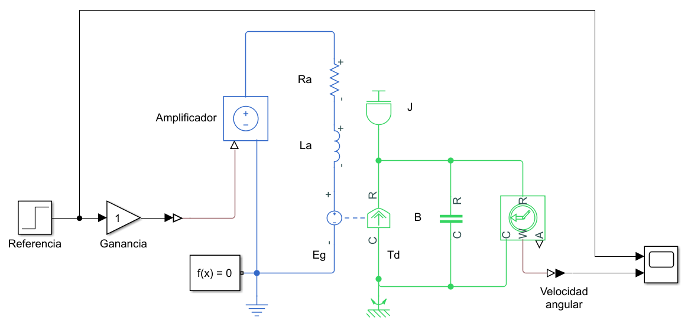
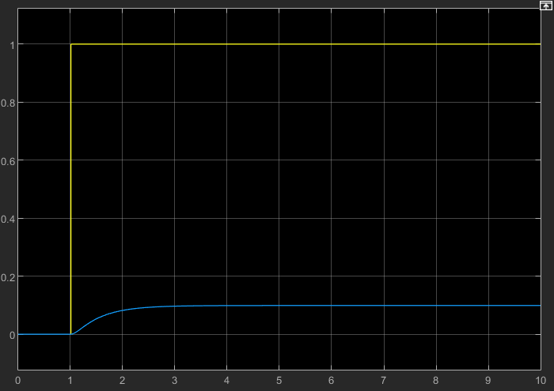
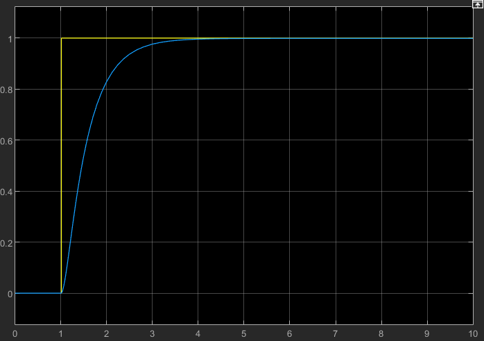

El modelo de *Simulink*, representa un motor de CD en lazo abierto. Los valores del modelo son los siguientes:

$$
\begin{aligned}
    J &= 0.01\text{ kg.m}^2\\
    B &= 0.1\text{ N.m}\\
    K_v &= 0.01 \frac{\text{V}}{\frac{\text{rad}}{\text{s}}}\\
    K_t &= 0.01 \frac{\text{N.m}}{\text{A}}\\
    R_a &= 1 \Omega\\
    L_a &= 0.5 \text{ H}\\
\end{aligned}
$$

Al simular su respuesta al impulso unitario, se obtiene el siguiente resultado:



Como se puede apreciar, no se llega a l valor requerido. Para ello, es necesario implementar una ganancia que que compense el sistema para que pueda llegar al valor deseado.

#### Ganancia de un sistema LTI en estado estacionario

La ganancia de un sistema en tiempo continuo se puede [calcular a partir de su modelo en variables de estado](https://la.mathworks.com/help/control/ref/lti.dcgain.html) como:

$$
K_s = D - C(I-A)^{-1}B
$$

#### Procedimiento

1. Obtener el modelo del sistema en variables de estado.
2. Obtener la ganancia del sistema en estado estacionario.
3. Calcular la inversa de la ganancia del sistema e implementarla en la ganancia del controlador.

Para esto se utiliza el siguiente script en MATLAB:

```matlab
J = 0.01;
B = 0.1;
K = 0.01;
Ra = 1;
La = 0.5;

s = tf('s');
H = K/((s*J + B)*(Ra + s*La) + K^2);
C = 1/dcgain(H)
```

El comando `dcgain` obtiene la ganancia de un sistema LTI en el estado estacionario.

-----

Así, para el ejemplo, la ganancia que se debe aplicar en el controlador es de $C = 10.01$

Cambiando la ganancia y volviendo a simular, se obtiene el siguiente resultado:


