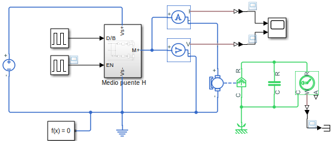
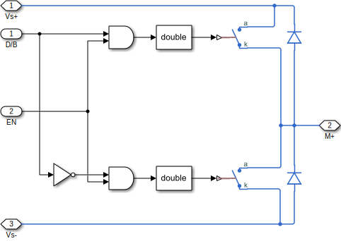
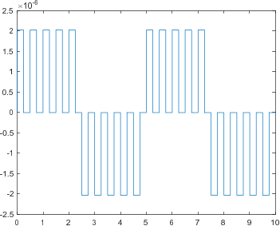

El medio puente H sirve para tener ambos driver y break en un sólo circuito y se implementa de la siguiente forma:

Se utiliza un submódulo, que se muestra a continuación:

El módulo tiene las terminales de $V_{s+}$, $V_{s-}$, la terminal de positivo del motor $M_+$ y las terminales de `D/B` y `EN`. El `EN` es el *enable* y permite el funcionamiento del circuito. Mientras que el `D/B` hace que el circuito funcione como driver mientras reciba un 1 y como break si recibe 0.

# Doble medio puente H
Para hacer una inversión de giro del motor, se puede implementar un doble medio puente H, como el incluído en el circuito [L298](https://www.sparkfun.com/datasheets/Robotics/L298_H_Bridge.pdf). Podemos simular con Simulink reutilizando la implementación del medio puente H:

Podemos tener una salida como esta:

