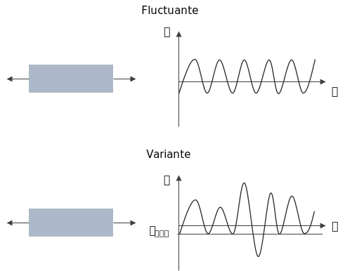
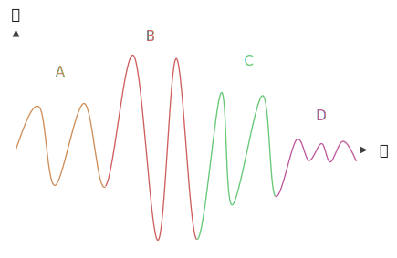
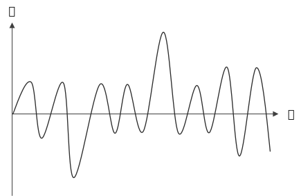

El esfuerzo variante a diferencia del fluctuante en fatiga, es que no tiene ciclos uniformes, algunos ciclos pueden tener mayor o menor amplitud.

Para atacar este problema, se intenta medir más bien la vida que quita cada ciclo a la pieza. Entonces, los ciclos con esfuerzos menores quitan menos vida que aquellos ciclos con esfuerzos más grandes.

# Regla de Miner
La regla de Miner es también conocida como la **regla del daño lineal acumulativo**. Que nos dice cuánto es el daño para cada nivel de esfuerzo:

$$
D = \sum \frac{n_i}{N_i}
$$

Donde:
$n_i$ es el número de ciclos con nivel de esfuerzo $\sigma_i$
$N_i$ es el número de ciclos que causarían la falla con un nivel de esfuerzo $\sigma_i$

Entonces, cuando $D$ llegue a $1$, ocurre la falla. Evidentemente si un esfuerzo es menor al límite de fatiga $S_e$ su daño será de 0.

## Ejemplo
1. Se hacen 5 ciclos con $\sigma_i = -60\ ksi$ a $20\ ksi$, se determina que la vida es de $N_i = 10^{4}$ ciclos. 
2. Se hacen 3 ciclos con $\sigma_i = -30\ ksi$ a $10\ ksi$, se determina que la vida es de $N_i = 5\times 10^{3}$ ciclos. 

Por lo tanto el daño acumulado es:

$$
D = \frac{5}{10^4} + \frac{3}{5\times10^3} = 1.1\times10^{-3}
$$

Suponiendo que este patrón de esfuerzos se repetira siempre así, podemos determinar el número de ciclos que la pieza tendrá:

$$
N = \frac{1}{D_\text{ciclo}} = \frac{1}{1.1\times10^{-3}} = 909 \text{ ciclos}
$$

## Limitaciones de la regla de Miner
### Orden de los ciclos
Una de las limitaciones que tiene la regla de Miner, es que no toma en cuenta el órden de los ciclos. Así que por ejemplo, si tenemos el la siguiente gráfica de ciclos:

Supongamos entonces que los esfuerzos en los ciclos $A$, $B$ y $C$ sí ocasionan daño. Pero que el ciclo $D$ no lo hace puesto que está debajo del límite de fatiga $S_e$. Entonces en la ecuación del daño, no estaría entrando, sin embargo no se toma en cuenta que debido a los ciclos anteriores, el límite de fatiga se ve modificado un poco $S_e$, entonces podría ser causante de daño también. Cosa que no ocurriría si el cíclo $D$ estuviera al inicio.

### Ciclos escondidos
Otra precaución que se debe tener, es que en una gráfica como la siguiente:

Aquí, el esfuerzo mínimo está en 1 ciclo, mientras que el máximo está en otro ciclo diferente. Al determinarlos como ciclos separados puede ser un error, y esto si en realidad esos dos juntos deberían contarse como 1 sólo ciclo máyor.

Existen métodos para conteo de ciclos más avanzados como el flujo de lluvia ([rainflow](https://en.wikipedia.org/wiki/Rainflow-counting_algorithm)) por ejemplo.
