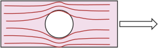

# Flujo de esfuerzos en un objeto
Para calcular el esfuerzo que sufre un objeto, se utilizan las siguientes consideraciones:

* El **esfuerzo** se distribuye **uniformemente**
    * Geometría uniforme
    * **Distancia** considerable entre el **punto de acción** y la superficie
* El material es **homogéneo**
* El material es **isotrópico**

Sin embargo, objetos que cumplan con todas las características no son tan comúnes en ingeniería. Las ranuras, muescas, etc de los objetos, hacen que el **flujo de esfuerzos** en el objeto no sea uniforme:

## Factor de concentración de esfuerzos
Para tomar en cuenta estas diferencias, se utiliza un **factor de concentración de esfuerzos**, que multiplica al *esfuerzo nominal* para saber cuál es el **esfuerzo máximo** en el objeto debido a su geometría.

$$
\begin{aligned}
\sigma_\text{max} &= K_t\sigma_\text{nom}\\
{\Large\tau}_\text{max} &= K_{ts}{\Large\tau}_\text{nom}\\
\end{aligned}
$$

Existen diagramas con varias geometrías donde se puede apreciar el factor de concentración de esfuerzo dependiendo de sus dimensiones.

### ¿Cuándo usar $K_t$?
* **Fatiga**: Se utiliza el factor de concentración de esfuerzos de fatiga $K_f$
* **Esfuerzo Estático**:
    * **Materiales frágiles** ($\varepsilon < 0.05$): Se utiliza el factor de concentración de esfuerzos $K_t$
    * **Materiales dúctiles** ($\varepsilon \geq 0.05$): *No* se utiliza el factor de concentración de esfuerzos $K_t$, **si se tomó en cuenta** los siguientes aspectos que pueden modificar el comportamiento dúctil:
        * Temperatura
        * Radiación
        * Fragilización por hidrógeno
        * Esfuerzos residuales

        > La razón de esto es porque en las ranuras de los materiales dúctiles, ocurre una **deformación plástica localizada**, lo que ocasiona un endurecimiento localizado.
