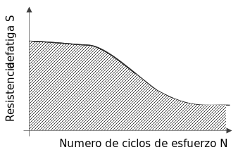
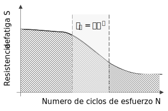

Las fallas por fatiga se dan cuando las cargas **varían en el tiempo**, pueden variar en **magnitud**, **punto de aplicación** o **dirección**.

La falla por fatiga se caracteriza por lo siguiente:
* Ocurre de forma **repentina** y **catastrófica**. Sin importar si es un material *dúctil* o *frágil*
* Ocurre por debajo de la resistencia a la fluencia
* Es compleja y difícil de predecir

# Propagación de grietas
La fatiga se da debido a la propagación de grietas en un material, siguiendo las siguientes etapas:

1. Se crea ua grieta debido a imperfecciones del material, vacío, desgarres, deformación localizada, etc.
2. La grieta se propaga en la pieza de forma ordenada
3. La grieta se propaga de forma inestable y muy rápido

# Diagrama Resistencia-Fuerza SN
El diagrama de resistencia vs. fuerza nos da una idea del tiempo de vida que tiene un material sometido a esfuerzos de fatiga. Se denomina $N$ al número de ciclos de la prueba.

Para tener un diseño seguro se debe diseñar debajo de la curva, para el número de ciclos que se espera estar en operación.

## Aproximación al diagrama SN
En el diagrama SN, se puede observar cierta relación en una parte de la curva, se puede aproximar dicha curva por medio de la siguiente expresión:

$$
\boxed{S_f = aN^b}
$$

$a$ y $b$ son constantes que se determinan por medio de las condiciones del material.

$$
a = \frac{(fS_{ut})^2}{S_e}
$$

$$
b = -\frac{1}{3}\log\left(\frac{fS_{ut}}{S_e}\right)
$$

Donde:
$f$ es la fracción de resistencia fatiga $S_f$ en los $10^3$ ciclos.
$S_{ut}$ es la resistencia última a la tensión.
$S_{e}$ es la resistencia a la fatiga del material en las condiciones de operación.

Despejando $N$, se puede obtener la expresión que nos dice cuanto es la vida útil de un objeto operando a un cierto nivel de esfuerzo.

$$
\boxed{N = \left(\frac{\sigma_\text{rev}}{a}\right)^{\frac{1}{b}}}
$$

### Cálculo de $f$
Las siguientes fórmulas son utilizadas para calcular $f$:

$$
f = \frac{\sigma_F}{S_{ut}}(2\times10^3)^{b}
$$

$$
\sigma_F = S_{ut} + 50 \text{ ksi}
$$

$\sigma_F$ es una aproximación tomada del ["Fatigue Design Handbook" de SAE](https://www.sae.org/publications/books/content/ae-22/).

$$
b = -\frac{\log\left[\frac{\sigma_F}{S_e'}\right]}{\log[2N_e]}
$$

Donde:
$N_e$ es el límite de vida de fatiga.
$S_e'$ es el límite de esfuerzo en fatiga de un espécimen de laboratorio.

> También existen tablas que se pueden utilizar para aproximar $f$

# Ejercicios
1. Para una espécimen de viga pulida, que rota en flexión pura, hecha de acero 4130 con un límite de resistencia a la fatiga $S_e$ de $42\text{ ksi}$, $f = 0.77$ y $S_{ut} = 95\text{ ksi}$. Determine:
* La resistencia a la fatiga del espécimen a $N = 10^{5}$ ciclos.
* El tiempo de vida esperado bajo carga completamente reversible de $60\text{ ksi}$.

$$
S_f = aN^{b}
$$

$$
a = \frac{[(0.77)(95)]^2}{42} = 127.4\text{ ksi}
$$

$$
b = -\frac{1}{3}\log\left[\frac{0.77(94)}{42}\right] = -0.08
$$

$$
S_f = 127.4(10^{5(0.08)}) = 50.7\text{ ksi}
$$

Cómo los valores de $a$ y $b$ no cambian, puesto que sólo cambia la carga:

$$
N_f = \left[\frac{60}{127.4}\right]^{-\frac{1}{0.08}} = 11790\text{ ciclos}
$$

