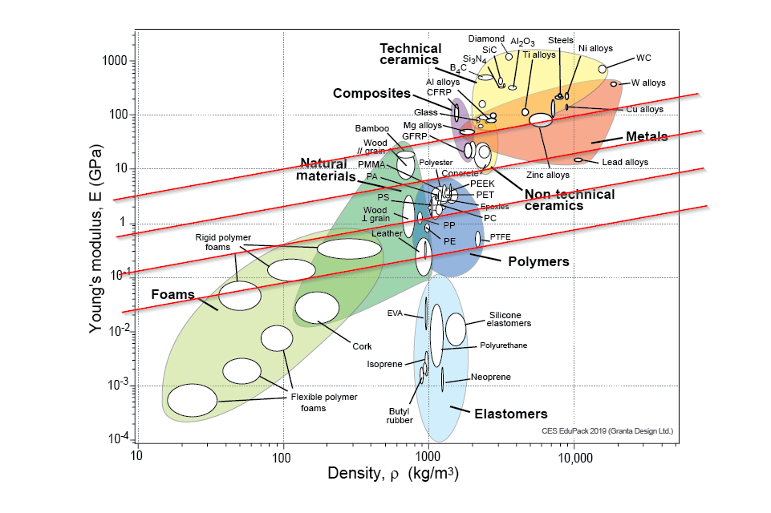

Para la selección de materiales, se deben tomar en cuenta diversos factores que, en muchas ocasiones, se entrelazan entre sí y su importancia es diferente para cada caso de aplicación.

Para esto, [Ashby](https://en.wikipedia.org/wiki/Michael_F._Ashby) creó las llamadas *gráficas de Ashby*, que son gráficas donde se tienen en ejes independientes, distintas propiedades de los materiales y en la gráfica se tienen grupos de materiales posicionados correspondientemente.

Por ejemplo, la siguiente imagen (de [grantadesign.com](https://www.grantadesign.com/education/students/charts/)) es la gráfica de Ashby de $E$ vs. $\rho$:

# Proceso de selección

1. Encontrar el índice del material a partir de su análisis matemático. e.g:
    
    $$
    M = \frac{E^{1/2}}{\rho}
    $$
    
    Donde $M$ es el índice del material.

    > Con esto se obtiene también la **pendiente** adecuada a ser utilizada en la gráfica de Ashby.

2. Se grafica la recta asociada a la pendiente en la gráfica de Ashby. e.g:
    

3. Los materiales que se puedan seleccionar, son aquellos que quedan por encima de la recta. Decidiendo por ejemplo, el mínimo módulo de elasticidad, se sabría con certeza con qué materiales se puede trabajar. Esta selección, se puede realizar utilizando más parámetros.

## Otras consideraciones importantes
Es necesario considerar, al seleccionar materiales cosas como:

* Entorno de operación
* Entorno de almacenaje y envío
* Costo
* Procesos de manufactura
* etc.
