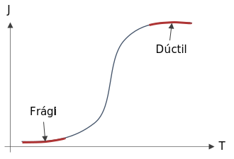

Conocer si un material es frágil o dúctil, es importante porque al fallar, los materiales frágiles, lo hacen de forma **catastrófica**, mientras que los dúctiles, presentan antes síntomas que son **perceptibles**.

Además, dependiendo de las condiciones de trabajo, el material puede necesitar cierta resistencia al impacto.

# Energía de impacto de muesca $J$
Energía de impacto de muesca (notch-impact energy), es una medida de la energía necesaria para fracturar un material con un defecto, como una **muesca** o **grieta**.

La **tenacidad de la muesca** se obtiene en el laboratorio con las pruebas de *Charpy* e *Izod* se utilizan para medir este parámetro. Sus unidades son $\frac{J}{m^3}$.

Los materiales con **baja** energía de impacto son por lo general **frágiles**, mientras que los que presentan **alta** energía de impacto son **dúctiles**.

# Temperatura de transición de dúctil a frágil

Si se hacen varios test de energía de impacto, a diferentes temperaturas, se obtiene una gráfica como esta:

La **temperatura de transición de dúctil a frágil**, es el rango de temperaturas donde la energía de impacto cambia rápidamente. En este caso, donde la pendiente es muy obvia.

Las gráficas obtenidas para diferentes materiales, depende de su tratamiento también.

# Comparación

| Dúctil                                | Frágil                                             |
| -                                     | -                                                  |
| Es claro dónde comienza la cedencia   | No es claro donde comienza la deformación plástica |
| La enlongación última es considerable | La enlongación última es pequeña                   |
| $\varepsilon_f \geq 0.05$             | $\varepsilon_f < 0.05$                             |
| Falla: cedencia                       | Falla: fractura                                    |
