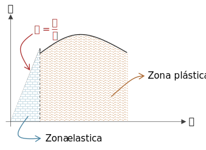

El módulo de elasticidad es la relación entre el esfuerzo y la deformación unitaria:

$$
E = \frac{\sigma}{\varepsilon}\qquad\left[\frac{N}{m^2}=Pa\right]\left[\frac{lbf}{in^2} = psi\right]
$$

Esta propiedad nos da una idea de la **rigidez** de un material. Es decir, que tan **difícil** es **deformarlo**. Si se tienen dos materiales con la misma geometría, el que tuviera el $E$ más alto, necesitará una carga mayor para ocasionar la misma deformación que en el otro.

Esta propiedad es la pendiente de la parte elástica en el diagrama esfuerzo deformación.

El módulo de elasticidad de algunos materiales comúnes es el siguiente:

| Material        | M. Elasticidad $[Mpsi]$ | M. Elasticidad $[GPa]$ |
| -               | :-:                     | :-:                    |
| Caucho          | 0.01                    | 0.1                    |
| Plástico ABS    | 0.23                    | 2.3                    |
| Titanio         | 16                      | 110                    |
| Acero al carbón | 29                      | 200                    |

## Módulo de elasticidad vs. resistencia
La resistencia es el esfuerzo máximo que se puede soportar, antes de deformarse permanentemente. El módulo de elasticidad tiene que ver con la carga necesaria para ocasionar cierta deformación elástica.

Mientas la resistencia puede variar dependiendo de tratamientos al material, el módulo de elasticidad no:

| Material                 | $E\ [Mpsi]$ | $S_y\ [ksi]$ |
| -                        | :-:         | :-:          |
| Acero AISI 1025 recocido | 29          | 36           |
| Acero AISI 4340 Q&T      | 29          | 214          |

# Selección de materiales por $E$
Los factores a tomar en cuenta son:

* Análisis de esfuerzos y análisis de elemento finito (FEA)
* Prevenir la deflexión dentro de una geometría delimitada
* Velocidad crítica
* Pandeo
