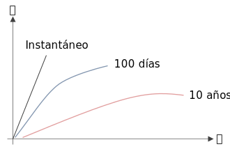
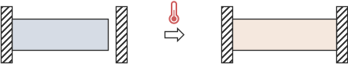
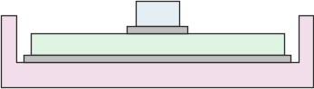

Al **diseñar** tomando en cuenta la **temperatura**, es muy importante tener en cuenta **todo el ciclo de vida** del material. Eso incluye también el traslado y almacenado del producto final. Pues podrían ser condiciones muy diferentes a las de operación.

Será necesario considerar valores **máximos** y **mínimos** en cada etapa de la vida del material. Así como los **tiempos** a los que se somete el material a esta temperatura, pues pueden causar fatiga en el material.

# Resistencia a cierta temperatura
Los materiales tienden a tener diferente resistencia a la fluencia que varía con la temperatura. Por lo tanto es importante tener esto en cuenta. Los valores comerciales se dan a temperatura ambiente.

Existen gráficas de resistencia $S_y$ vs. temperatura $T$ como la que se muestra a continuación ([tomada de aquí](https://firesciencereviews.springeropen.com/articles/10.1186/s40038-015-0007-5)):

# Creep
El creep o deformación por fluencia lenta, es un tipo de **deformación continua** que **depende del tiempo** bajo una cierta carga. Su característica más importante es que la **fluencia** de hecho **ocurre abajo de la resistencia a la fluencia!**

Esto ocurre principalmente en **materiales ferrosos** que están expuestos **temperaturas elevadas** y se les aplica una **carga** por **periodos largos de tiempo**. Así que es importante tener en cuenta lo siguiente:

* Material
* Temperatura de exposición
* Duración de la exposición a la temperatura
* Carga
* Duración de la exposición a la carga

# Diferente CET ($\alpha$)
El **coeficiente de expansión térmica** es una propiedad del material que indíca cuanto se deforma un material cuando cambia su temperatura.

$$
\varepsilon = \alpha \Delta T
$$

Esto es importante de considerar cuando se trabaja con **distintos materiales** que serán expuestos a **cambios de temperatura**.

La consideración más obvia sería prevenir que los materiales no choquen entre sí o no se presionen unos a otros al expandirse.

Esto puede ocasionar esfuerzos en el ambos materiales.

---

Sin embargo, otro problema importante pero menos inmediato es lo que pasa con los materiales diferentes unidos entre sí:

Las consideraciones se pudieron haber tomado para que cada material soporte el esfuerzo y la deformación ocurrida por la dilatación térmica. Sin embargo, al estar unidos, la **deformación** del **material adyacente** ocasionará **esfuerzos mayores** en la pieza.

Una **forma** de **solucionar** esto sería por ejemplo poner un **material intermedio** que cuya **rigidez** sea **menor** a la de **ambos** y que pueda absorber las deformaciones entre materiales:

