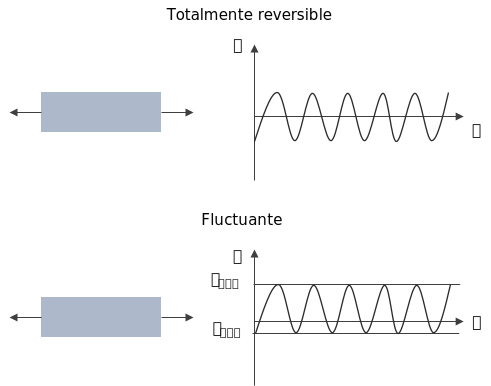
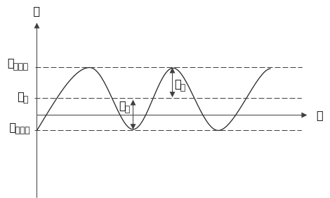
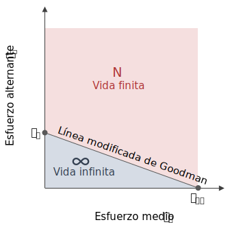
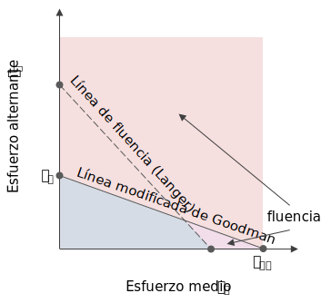
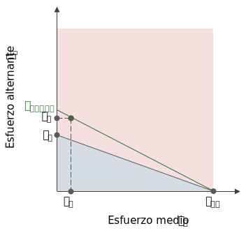

La diferencia con el esfuerzo totalmente reversible era que este es más uniforme en los ciclos y la carga tiene la misma magnitud en un sentido y en el otro. Mientras que el esfuerzo fluctuante de fatiga no:

El esfuerzo fluctuante de fatiga se caracteriza de la siguiente forma:

$$
\begin{aligned}
\text{Rango}\qquad& R = \frac{\sigma_{min}}{\sigma_{max}}\\
\\
\text{Esfuerzo medio}\qquad& \boxed{\sigma_{m} = \frac{\sigma_{max}+\sigma_{min}}{2}}\\
\\
\text{Esfuerzo alternante}\qquad& \boxed{\sigma_{a} = \frac{\sigma_{max}-\sigma_{min}}{2}}\\
\end{aligned}
$$

# Factores de concentración de esfuerzos en esfuerzo fluctuante de fatiga
Siempre que hay una discontinuidad **se debe usar un factor de concentración de esfuerzos**. La pregunta es, a qué componente se le debe aplicar el factor? Existen 2 casos:

* No hay esfuerzo plástico en la muesca:
    
    $$
    \sigma_a = K_f \sigma_{a\_nom}\qquad\sigma_m = K_f \sigma_{m\_nom}
    $$
    
* La deformación plástica en la muesca no puede evitarse:
    
    $$
    \sigma_a = K_f \sigma_{a\_nom}\qquad\sigma_m = \sigma_{m\_nom}
    $$
    
La mejor práctica es realizar pruebas con la geometría a utilizar, número de ciclos y carga fluctuante.

# Línea de Goodman modificada
Si se considera un esfuerzo estático, sólo tendría componente de esfuerzo medio $\sigma_m$ y fallaría en $S_{ut}$. Por otro lado un esfuerzo completamente reversible tendría un $\sigma_m = 0$, y podemos saber que el material no tiene vida infinita en $S_e$.

La línea de Goodman se traza como la que une $S_e$ y $S_{ut}$, graficando el esfuerzo alternante $\sigma_a$ contra el esfuerzo medio $\sigma_m$.

Todos los esfuerzos por debajo de la línea, son soportables por el material teniendo vida infinita, mientras que todos los de arriba harán que el material tenga una vida finita.

La ecuación de la línea de Goodman modificada es:

$$
\boxed{\frac{\sigma_a}{S_e} + \frac{\sigma_m}{S_{ut}} = \frac{1}{n}}
$$

Donde podemos concluir que:

$$
\begin{cases}
    n > 1 & \text{Vida infinita }\infty\\
    n < 1 & \text{Vida finita } N
\end{cases}
$$

## Línea de fluencia (Langer)

Ahora bien, la línea modificada de Goodman contempla la vida con los esfuerzos últimos. Sin embargo, se necesita tomar en cuenta también la fluencia. Y esa la contempla el criterio de fluencia de Langer.

Esta línea contempla los esfuerzos de deformación en alternante y medio. Una sección de la línea cruza por la zona de vida infinita de la línea modificada de Goodman y por lo tanto hay que tener también en cuenta esto. Su ecuación es la siguiente:

$$
\boxed{\sigma_a + \sigma_m = \frac{S_y}{n}}
$$

$$
\begin{cases}
    n > 1 & \text{No hay fluencia }\\
    n < 1 & \text{Hay fluencia}
\end{cases}
$$

## Estimación de número de ciclos
Para estimar el número de ciclos si una pieza cae arriba de la línea modificada de Goodman. Se hace obteniendo el esfuerzo reversible equivalente.

Para encontrarlo, a partir de la ecuación de la línea de Goodman, se encuantra la intersección de la línea con el eje de $\sigma_a$. Cambiando $S_e$ por $\sigma_{rev\_eq}$ se logra:

$$
\frac{\sigma_a}{\sigma_{rev\_eq}} + \frac{\sigma_m}{S_{ut}} = \frac{1}{n}
$$

$$
\boxed{\sigma_{rev\_eq} = \dfrac{\sigma_a}{1 - \dfrac{\sigma_m}{S_{ut}}}}
$$

Así, se calcula el tiempo de vida como se hace para un esfuerzo totalmente reversible:

$$
N = \left(\dfrac{\sigma_{rev\_eq}}{a}\right)^{1/b}
$$
