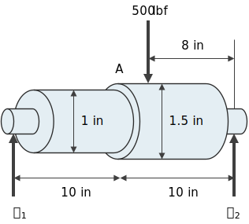

En fatiga siempre se deberían utilizar los factores de concentración de esfuerzos, pues la falla viene sin advertencia.

El factor de concentración de esfuerzos en fatiga es $K_f$:

> $K_f$ es diferente de $k_f$ (el factor de Marin).

$$
\boxed{K_f = 1 + q(K_t-1)}
$$

$$
\sigma_\text{max} = K_f \sigma_\text{nominal}
$$

$$
\tau_\text{max} = K_f \tau_\text{nominal}
$$

Donde $q$ es la sensibilidad a muescas. Algunos materiales tienen son más resistentes a muescas o discontinuidades.

Para determinar $q$:
* Lo mejor es utilizar gráficas de sensibilidad de muesca.
    * Datos de prueba
    * Stress Concentrations - Peterson
    * Mechanical Engineering Design - Shigley
    * Fundamentals of Machine Component Design
    * Metal Fatigue
* O se puede aproximar con:

    $$
    q = \frac{1}{1 + \frac{\sqrt{a}}{\sqrt{r}}}
    $$

    $$
    \sqrt{a} = 0.246 - 3.08\times10^{-3}S_{ut}+1.51\times10^{-5}S_{ut}^2-2.67\times10^{-8}S_{ut}^3
    $$

    Donde $r$ es el radio de la muesca y $S_{ut}$ está en $\text{ksi}$.

* Si se duda del valor de $q$ se puede ser más muy conservativo y utilizar $K_f = K_t$. Puesto que $K_t > K_f$

# Ejemplo

La barra rotatoria está bajo flexión totalmente reversible. Está simplemente soportada por rodamientos en $R_1$ y $R_2$. El radio de todos los filetes es de $r = 0.1\text{ in}$. Las condiciones de superficie del eje son $a = 1.34\text{ ksi}$ y $b = -0.085\text{ ksi}$. Se requiere una confiabilidad de $99.99\%$. El eje está hecho de acero 5Cr-Mo-V aeronáutico, con $S_{ut} = 240\text{ ksi}$ y estará operando a $600 ºF$.

¿Cuál es el factor de concentración de esfuerzos en fatiga $K_f$ en el punto $A$?

Tomado de una gráfica del Peterson, $K_t = 1.7$.

$$
\begin{aligned}
\sqrt{a} &= 0.246 - 3.08\times10^{-3}S_{ut}+1.51\times10^{-5}S_{ut}^2-2.67\times10^{-8}S_{ut}^3\\
&= 0.246 - 3.08\times10^{-3}(240)+1.51\times10^{-5}(240^2)-2.67\times10^{-8}(240^3)\\
& \approx -7.5\times10^{-3}
\end{aligned}
$$

$$
q = \frac{1}{1 + \frac{-368231779}{\sqrt{0.1}}} \approx 0.97
$$

$$
K_f = 1 + 0.97(1.7-1) \approx \boxed{1.68}
$$

Por lo tanto:

$$
\sigma_\text{max} = 1.68\sigma_A
$$

