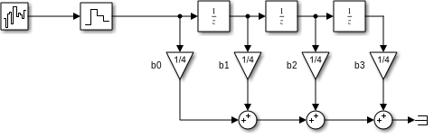

# Filtros
Los **filtros** son fundamentales en el procesamiento digital de señales y son los **filtros digitales** los más ampliamente usados en este campo. Los filtros sirven para operar en distintas frecuencias sobre distintos fines. Los *tipos* de filtros más comunes son los siguientes:

* Filtros **pasa bajas**: Atenúan frecuencias altas.
* Filtros **pasa altas**: Atenúan frecuencias bajas.
* Filtros **pasa bandas**: Atenúan frecuencias fuera de un rango.
* Filtros **rechaza bandas**: Atenúan frecuencias dentro de un rango.
* Filtros de **peine**: Atenúan una cierta frecuencia y todos sus armónicos.
* Filtros **pasa todo**: No atenúan ninguna frecuencia pero puede modificar la fase.

Todos estos tipos de filtros pueden ser implementados de forma **analógica** o **digital**. Los filtros **analógicos** han sido muy estudiados y se consiguen resultados muy buenos en su implementación, sin embargo, al ser sistemas analógicos, como **desventaja** que su **comportamiento varía** con la *temperatura* y el *tiempo*. En procesamiento digital de señales por lo general se ocupan filtros **digitales** porque tienen las siguientes **ventajas**:

* Son programables, no es necesario cambiar el circuito, sólo el programa
* Dos filtros idénticos se compartan idéntico
* Su comportamiento no varía con el tiempo y la temperatura

En los filtros digitales existen 2 tipos, los filtros de respuesta finita al impulso *FIR* y los filtros de respuesta infinita al impulso *IIR*.

# Filtro de Respuesta finita al impulso FIR
El filtro **FIR** es un filtro **no recursivo**, o sea que se utilizan las *entradas previas* en el filtro.

Como se puede ver, tiene un retardo de la señal, en este caso, 3 retardos, que luego se suman, ponderando una ganancia de 1. La salida es la siguiente:

Como se puede ver, en la señal de salida (*out*) es más fácil ver la tendencia de la señal.

En este caso el filtro *FIR* implementado es de orden 3, pues hay 3 retardos. Pero pueden ser de orden $n$ y la expresión de su función de transferencia es la siguiente:

$$
T(z) = a_0 + a_1z^{-1} + a_2z^{-1} + \ldots + a_nz^{-1}
$$
