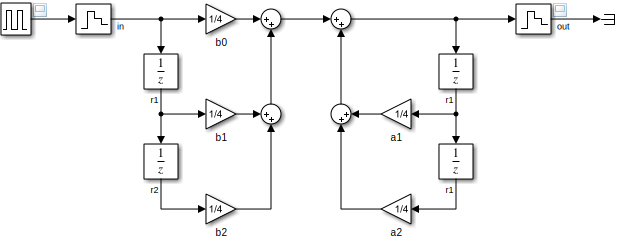
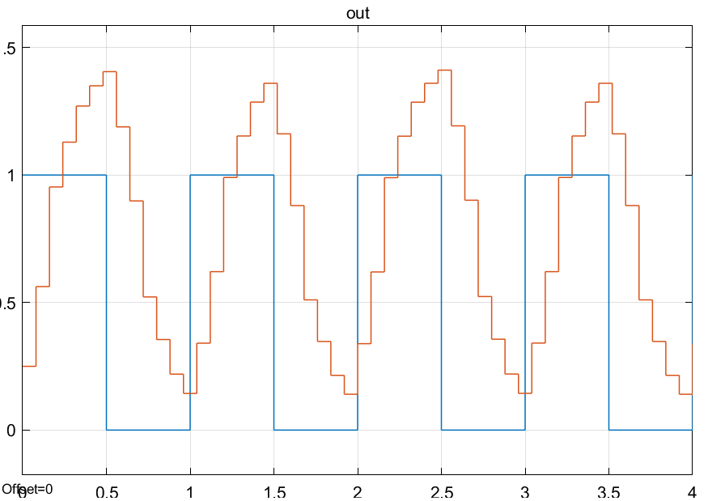
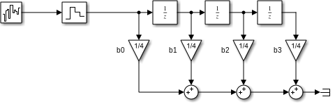
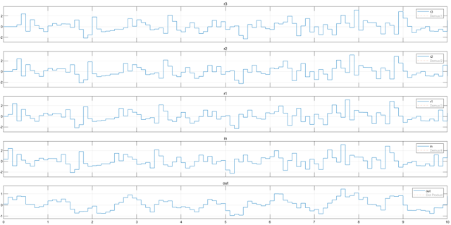

# Filtros
Los **filtros** son fundamentales en el procesamiento digital de señales y son los **filtros digitales** los más ampliamente usados en este campo. Los filtros sirven para operar en distintas frecuencias sobre distintos fines. Los *tipos* de filtros más comunes son los siguientes:

* Filtros **pasa bajas**: Atenúan frecuencias altas.
* Filtros **pasa altas**: Atenúan frecuencias bajas.
* Filtros **pasa bandas**: Atenúan frecuencias fuera de un rango.
* Filtros **rechaza bandas**: Atenúan frecuencias dentro de un rango.
* Filtros de **peine**: Atenúan una cierta frecuencia y todos sus armónicos.
* Filtros **pasa todo**: No atenúan ninguna frecuencia pero puede modificar la fase.

Todos estos tipos de filtros pueden ser implementados de forma **analógica** o **digital**. Los filtros **analógicos** han sido muy estudiados y se consiguen resultados muy buenos en su implementación, sin embargo, al ser sistemas analógicos, como **desventaja** que su **comportamiento varía** con la *temperatura* y el *tiempo*. En procesamiento digital de señales por lo general se ocupan filtros **digitales** porque tienen las siguientes **ventajas**:

* Son programables, no es necesario cambiar el circuito, sólo el programa
* Dos filtros idénticos se compartan idéntico
* Su comportamiento no varía con el tiempo y la temperatura

En los filtros digitales existen 2 tipos, los filtros de respuesta finita al impulso *FIR* y los filtros de respuesta infinita al impulso *IIR*.

# Funcionamiento de un filtro digital
Se parte de la respuesta discreta al impulso, por medio de la suma de convolución:

$$
y[n] = \sum^\infty_{k=0} b[k]x[n-k]
$$

Donde:
$y$ es la salida
$x$ es la entrada
$b$ es la respuesta al impulso

Transformando esta forma, en una parte *finita* y otra *infinita* $O(u,n)$:

$$
y[n] = \sum^N_{k=0} b[k]x[n-k] + O(u,n)
$$

# Filtro de respuesta infinita al impulso IIR
$O(u,n)$ debe ser una función computable, ya que en realidad no es posible con sistemas digitales obtener una respuesta que tiende a infinito. Por ejemplo, la siguiente función no es computable:

$$
O(x,n) = \sum^\infty_{k=N+1} b[k]x[n-k]
$$

Así que se busca otra función, como:

$$
O(y,n) = - \sum^M_{k=1}a[k]y[n-k]
$$

Entonces se tiene retroalimentación de la salida, lo que permite tener un acercamiento al comportamiento en infinito y es computable. La forma del filtro IIR es la siguiente:

$$
\boxed{y[n] = \sum^N_{k=0} b[k]x[n-k] - \sum^M_{k=1}a[k]y[n-k]}
$$

Sin embargo, ya que el sistema tiene retroalimentación, esto conlleva a problemas de estabilidad y entonces los coeficientes $a[n]$ se vuelven importantes, puesto que de no calcularlos bien, el filtro no sirve.

Su función de transferencia es la siguiente:

$$
G(z) = \frac{b_0 + b_1z^{-1} + b_2z^{-2} + \cdots + b_Nz^{-N}}{1 + a_1z^{-1} + a_2z^{-2} + \cdots + a_Mz^{-M}}
$$

Su implementación en Simulink para un filtro IIR de orden 2 es la siguiente:

Y su salida es la siguiente:

# Filtro de respuesta finita al impulso FIR
El filtro **FIR** es un filtro **no recursivo**, o sea que se utilizan las *entradas previas* en el filtro sólamente. Es decir, se suponen los coeficientes $a[n] = 0$ y tiene la siguiente forma:

$$
\boxed{y[n] = \sum^N_{k=0} b[k]x[n-k]}
$$

Su implementación en Simulink es la siguiente:

Como se puede ver, tiene un retardo de la señal, en este caso, 3 retardos, que luego se suman, ponderando una ganancia de 1. La salida es la siguiente:

Como se puede ver, en la señal de salida (*out*) es más fácil ver la tendencia de la señal.

En este caso el filtro *FIR* implementado es de orden 3, pues hay 3 retardos. Pero pueden ser de orden $n$ y la expresión de su función de transferencia es la siguiente:

$$
T(z) = a_0 + a_1z^{-1} + a_2z^{-1} + \ldots + a_nz^{-1}
$$
