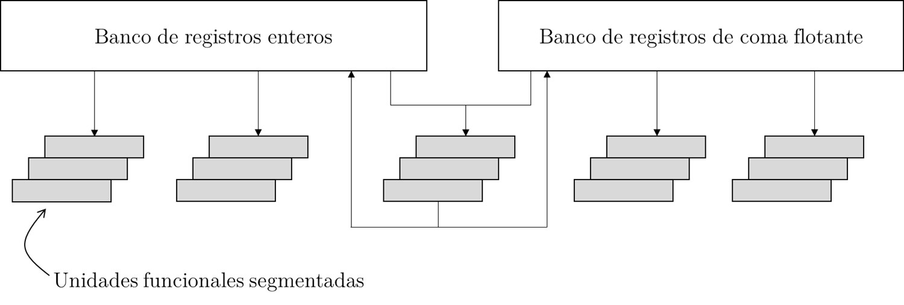
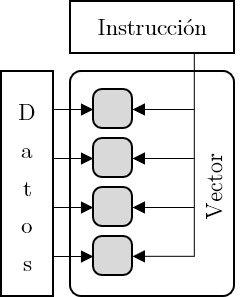

El Arm Cortex-A53, tiene características que le permiten llevar a cabo procesamiento con técnicas de DSP. En concreto tiene que ver con **paralelización** y **capacidad de cómputo**.

## Paralelización
La paralelización consiste en transformar un programa secuencial en una versión concurrente pero equivalente. Esto con el fin de ejecutar los programas más rápidamente.

### Procesador multinúcleos
El procesador multinúcleos quiere quiere decir que se contienen más de un procesador en un mismo circuito integrado, con capacidades de realizar operaciones en paralelo. Así, se puede partir un programa en hilos, para que se computen operaciones al mismo tiempo.

El [Arm Cortex-A53](https://developer.arm.com/documentation/ddi0500/latest/) puede contener de 1 a 4 núcleos. El procesador Broadcom2837 tiene 4 núcleos Arm Cortex-A53 y está [implementado en la Raspberry Pi 3](https://www.raspberrypi.org/documentation/computers/processors.html).

### Núcleos superescalares
Los núcleos superescalares tienen una arquitectura que les permite ejecutar más de una instrucción por ciclo de reloj, a diferencia de la arquitectura escalar que ejecuta sólo una por ciclo de reloj.

Este ejemplo de arquitectura permite ejecutar por ejemplo dos operaciones en enteros, dos en coma flotante y una de transferencia de memoria. O sea que no todas las instrucciones deben poder tener varias unidades funcionales.

Como se puede apreciar, el diseño superescalar además es compatible con **segmentación**. Lo que permite implementar **paralelismo de flujo** también.

#### Pipeline
El [*pipeline*](https://www.sciencedirect.com/topics/computer-science/stage-pipeline) o segmentación de instrucciones es la forma en que los procesadores con arquitectura RISC ejecutan instrucciones. Esto hace que la ejecución sea más rápida, cargando las siguientes instrucciones mientras se procesa la primera.

Es como la línea de ensamblaje de un carro, sólo que aquí se divide en sub tareas que permiten un flujo constante de instrucciones. Mientras **más largo** sea el pipeline, **menor el trabajo** necesario en cada etapa, **aumentando la eficiencia**. Sin embargo se necesitarán **más ciclos de reloj** para completar **un ciclo máquina**, **aumentando la latencia** del sistema.

El Arm Cortex-A53 implementa una segmentación de instrucciones o *pipeline* de 8 etapas con la siguiente escturctura según [Matt Humrick en su post en ANANDTECH](https://www.anandtech.com/show/11441/dynamiq-and-arms-new-cpus-cortex-a75-a55/4):

Dentro de la etapa de ejecución, se pueden despachar instrucciones simultáneamente a diferentes unidades de ejecución, como ejemplo:

* Unidad aritmético-lógica (ALU)
* Unidad de generación de direcciones (AGU)
* Unidad multiplicador-acumulador (MAC)

También hay que tomar en cuenta que no todas las instrucciones se ejecutan en un sólo ciclo (Issue Cycle). O sea que cambiar el orden de las instrucciones, puede cambiar el número de ciclos.

### Arquitectura 64 bits
El Arm Cortex-A53 tiene una arquitectura Armv8-A que es de 64 bits, es decir con palabras de memoria de 64 bits. Utiliza el set de instrucciones *A64*, sin embargo, también es compatible con el set de instrucciones de 32 bit, en su modo AArch32.

#### Modos de operación
Existen dos modos de operación del Arm Cortex-A53:

* **AArch64**
    Este modo de operación sólo tiene un set de instrucciones llamado *A64*, que tiene instrucciones de 32 bits de tamaño fijo.
* **AArch32**
    Este modo tiene 2 sets de instrucciones.
    * *A32* (ARM)
        Es un set de 32 bits de tamaño fijo de instrucción.
    * *T32* (Thumb)
        Es un set de tamaño variable de instrucción de 32 o 16 bits.

> En el curso se utilizará el modo AARch32, puesto que es en el que está implementado por Raspberry Pi

### Extensiones NEON
La tecnología NEON, es una extensión para los Arm Cortex-A y Cortex-R. Esta extensión implementa la tecnología llamada *Single Instruction Multiple Data* *SIMD*. Con esta, se consigue **paralelización a nivel de datos**.

Funciona realizando una operación (instrucción) sobre una piscina de datos, los datos son diferentes entre sí pero se les aplica la misma operación al mismo tiempo, a esto se le conoce como **vectorizar operaciones**.

Esto está pensado para procesamiento de señales, audio, video e inteligencia artificial. Permite operar con diferentes tipos de dato, incluyendo números de punto fijo y flotante.

En el Arm Cortex-A53 cuenta con registros de 32 $\times$ 128 bits para los datos.

## Registros

Se cuentan con varios registros de propósito general y algunos especiales. A continuación se muestran los registros de aplicación del Arm Cortex-A53.

| Nombre | Alias | Uso más frecuente    | Uso convencional                                    |
|--------|-------|----------------------|-----------------------------------------------------|
| r0     | a1    | Propósito general    | Valores temporales, regreso de valores de funciones |
| r1     | a2    | Propósito general    | Valores temporales, regreso de valores de funciones |
| r2     | a3    | Propósito general    | Valores temporales, argumento de funciones          |
| r3     | a4    | Propósito general    | Valores temporales, argumento de funciones          |
| r4     | v1    | Propósito general    | Variables                                           |
| r5     | v2    | Propósito general    | Variables                                           |
| r6     | v3    | Propósito general    | Variables                                           |
| r7     | v4    | Propósito general    | Variables                                           |
| r8     | v5    | Propósito general    | Variables                                           |
| r9     | v6    | Propósito general    | Variables                                           |
| r10    | v7    | Propósito general    | Variables                                           |
| r11    | v8    | Propósito general    | Variables                                           |
| r12    | v9    | Propósito general    | Variables                                           |
| r13    | sp    | Puntero de pila      | Propósito general                                   |
| r14    | lr    | Registro de enlace   | Propósito general                                   |
| r15    | pc    | Contador de programa |                                                     |

