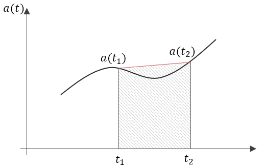

Tomando en cuenta el sistema mása resorte amortiguador:

Para medir el desplazamiento de $m$ se utiliza un circuito de capacitores diferenciales

{:width="400px"}

Su circuito equivalente es el siguiente:

{height="350px"}

$$
V_o = V_s - V_{C1}
$$

$$
\begin{aligned}
    q_1 &= C_1(V_s - V_o)\\
    q_2 &= C_2(V_o + V_s)\\
\end{aligned}
$$

$$
\begin{aligned}
    C_1(V_s - V_o) &= C_2(V_o + V_s)\\
    C_1V_s - C_1V_o &= C_2V_o + C_2V_s\\
    C_1V_s - C_2V_s &= C_1V_o + C_2V_o\\
\end{aligned}
$$

$$
\boxed{V_o = \frac{C_1 - C_2}{C_1 + C_2} V_s}
$$

Como

$$
C_1 = \frac{1}{G_1}\qquad C_2 = \frac{1}{G_2}
$$

Entonces

$$
\boxed{V_o = \frac{G_2 - G_1}{C_1 + C_2} V_s}
$$

#### Funcionamiento general
* La aceleración produce un desplazamiento en el sensor.
* El desplazamiento genera un cambio en los valores de las capacitancias.
* El cambio en las capacitancias produce una tensión de salida.

### Modelo matemático

$$
\tag{1}
m\ddot{x} + b\dot{x} + kx = F = ma
$$

Aplicando la transformada de Laplace en $(1)$ con $c.i. = 0$.

$$
\tag{2}
\begin{aligned}
    \frac{X(s)}{\large a(s)} &= \frac{m}{m s^2  + bs + k}\\
    &= \frac{1}{s^2  + \frac{b}{m}s + \frac{k}{m}}\\
\end{aligned}
$$

Comparando el sistema con la función de transferencia general para sistemas de segundo orden:

$$
\dfrac{C(s)}{R(s)}=\dfrac{\omega_n^2}{s^2+2\xi\omega_n s +\omega_n^2}
$$

Podremos estimar cual es la frecuencia natural del sistema y su factor de amortiguamiento.

$$
\omega_0 = \sqrt{\frac{k}{m}}
$$

$$
\xi = \frac{b}{2\sqrt{km}}
$$

Siendo $a$ constante en $(2)$, se puede determinar el valor de $x$ en estado estacionario.

$$
\boxed{x = \frac{ma}{k}}
$$

#### Método del trapecio

$$
a(t)= a(t_1) + \frac{a(t_2) - a(t_1)}{t_2 - t_1}(t - t_1)
$$

$$
\begin{aligned}
v(t) &= \int^{t_2}_{t_1}a(t)dt = a(t_1)\int^{t_2}_{t_1}dt + \frac{a(t_2) - a(t_1)}{t_2 - t_1}\int^{t_2}_{t_1}(t - t_1)dt\\
&= a(t_1)[t_2 - t_1] + \frac{a(t_2) - a(t_1)}{t_2 - t_1}\frac{(t_2 - t_1)^2}{2}
\end{aligned}
$$

Por lo tanto

$$
\boxed{v(t) = (t_2 - t_1)\frac{a(t_1) + a(t_2)}{2}}
$$

