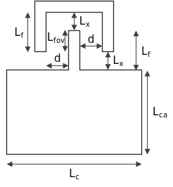
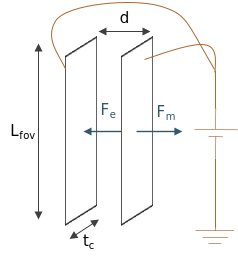

Analizando el siguiente modelo:

$$
L_f = L_{fvo} + L_x
$$

## Capacitancia

$$
A = L_{fov} tc
$$

$$
C = \frac{Q}{V} = \frac{\varepsilon A}{d}
$$

Donde:
$\varepsilon$: Permitividad

$$
C_1 = \frac{\varepsilon A}{d+x}\quad,\quad C_2 = \frac{\varepsilon A}{d-x}
$$

$$
\begin{aligned}
    \Delta C &= C_1 - C_2 = \varepsilon A \left(\frac{1}{d +x} - \frac{1}{d-x}\right)\\
    &= \varepsilon A\left(\frac{-2x}{d^2 - x^2}\right)
\end{aligned}
$$

Desarrollando:

$$
\tag{1}
\Delta C x^2 - 2\varepsilon A x - \Delta C d^2 = 0
$$

Resolviendo para $(1)$:

$$
\boxed{x = \frac{\varepsilon A}{\Delta C} \pm \sqrt{\left(\varepsilon \frac{A}{\Delta C}\right)^2 + d^2}}
$$

## Fuerza eléctrica

$$
F_e = \frac{1 \varepsilon A V^2}{2 d^2} = ma
$$

$$
\boxed{m = \frac{1 \varepsilon A V^2}{2 a d^2}}
$$

## Resorte

$$
Fr = kx = ma
$$

$$
\boxed{k = \frac{ma}{x}}
$$
