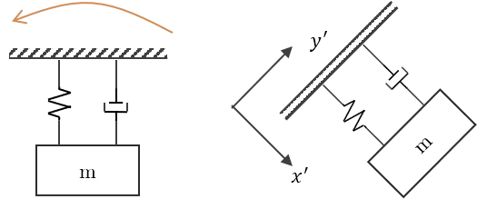
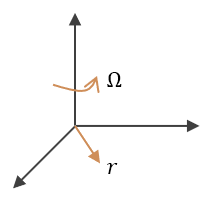
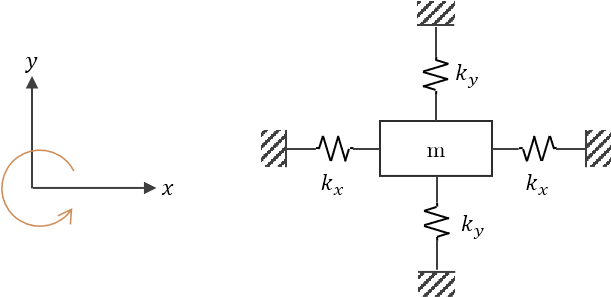

La descripción completa del movimiento de un objeto requiere conocer todas sus componentes de velocidad.

El mecanismo utilizado para medir las velocidades angulares es el mismo que en el caso del [acelerómetro](./Microacelerómetro.html), sólo que para ese sensor se toma la variación del marco de referencia fijo. Para este sensor se toma el marco de referencia rotacional.

Por lo tanto, una Unidad de Medición Inercial (IMU) sirve para medir aceleraciones lineales y movimientos rotacionales.

> Generalmente por eso se tienen ambos sensores en 1, porque se pueden medir ambos usando el mismo mecanismo.

El dispositivo para medir el movimiento rotacional de un objeto se denomina **giroscopio**.

# Análisis cinemático

Sea $v_i$ la velocidad de la partícula en el marco de referencia inercial, y sea $v_r$ la velocidad relacionada con el marco de referencia rotacional.

Se define la relación,

$$
\tag{1}
v_i = v_r + (\Omega \times r)
$$

Donde:
$r$ es el vector de posición con respecto a la rotación, es decir, es la posición relativa con respecto al centro de rotación.

Se define el operador equivalente en el marco de referencia rotacional tomando la derivada con respecto al tiempo en el marco de referencia inercial.

$$
\tag{2}
\left(\frac{d\cdot}{dt}\right)_i = \left(\frac{d\cdot}{dt}\right)_r + \Omega \times \cdot
$$

Aplicando el operador $(2)$ a la ecuación $(1)$,

$$
\tag{3}
\left(\frac{dv_i}{dt}\right)_i = a_i = \left(\frac{dv_i}{dt}\right)_r + \Omega \times v_i
$$

Sustituyendo $(1)$ en $(3)$,

$$
\begin{aligned}
    a_i &= \left(\frac{d}{dt}\left(v_r + (\Omega\times r)\right)\right) + \Omega\times(v_r + (\Omega\times r))\\
    &= \left(\frac{d}{dt}v_r\right)_r + \frac{d}{dt}(\Omega\times r) + (\Omega\times v_r) + \Omega\times(\Omega\times r)\\
\end{aligned}
$$

$$
\tag{4}
a_i = a_r + \dot{\Omega}\times r + \Omega\times\dot{r} + (\Omega\times v_r) + \Omega\times(\Omega\times r)
$$

Se tiene que

$$
\tag{5}
\dot{r} = \left(\frac{dr}{dt}\right)_r = v_r
$$

Sustituyendo $(5)$ en $(4)$

$$
\tag{6}
a_i = a_r + 2\ \Omega\times v_r + \Omega\times(\Omega\times r) + (\dot{\Omega}\times r)
$$

Multiplicando $(6)$ por $m$:

$$
\tag{7}
F = m a_i = m a_r + \underbrace{2 m \Omega\times v_r}_\text{Fuerza de Coriolis} + m \Omega\times(\Omega\times r) + m\dot{\Omega}\times r
$$

Si la ecuación $(7)$ se aplica al movimiento de una partícula restringida en el plano $xy$, se obtienen 2 ecuaciones:

$$
\def\i{\hat{\imath}}
\def\j{\hat{\jmath}}
\begin{aligned}
r = \i x + \i y\quad&,\quad v_r = \dot{r} = \i \dot{x} + \j \dot{y}\\
\Omega &= \hat{k} \Omega 
\end{aligned}
$$

$$
\begin{aligned}
F_x &= m\ddot{x} - 2m\dot{y}\Omega -m\Omega^2x - m\dot{\Omega}y\\
F_y &= m\ddot{y} + 2m\dot{x}\Omega -m\Omega^2y + m\dot{\Omega}x\\
\end{aligned}
$$

La **fuerza de Coriolis** son los términos $2m\dot{y}\Omega$ y $2m\dot{x}\Omega$

> Es la fuerza de Coriolis la que ha sido más explotada en principios utilizados para sensores.

# Modelo simplificado para un giroscopio

$$
F_x = -2k_x x = m\ddot{x}
$$

$$
m\ddot{x} + 2k_x x = 0
$$

$$
\ddot{x} + \frac{2k_x}{m} x = 0
$$

Por lo tanto, la frecuencia natural del sistema:

$$
\omega_x = \sqrt{\frac{2k_x}{m}}
$$

Análogamente,

$$
\omega_y = \sqrt{\frac{2k_y}{m}}
$$
