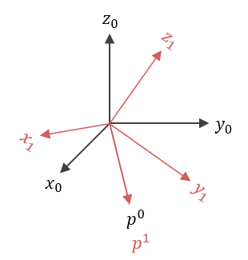

# Matrices de rotación
Son matrices que describen una **operación** de rotación:

$$
p^{0} = R^{0}_1 p^{1}
$$

Donde:
$p^0$ es el punto en el marco $0$.
$R^0_1$ es la matriz de rotación que vincula el marco $1$ hacia el marco $0$.
$p^0$ es el punto en el marco $1$.

Los puntos son físicamente el mismo, pero sus descripciones cambian dependiendo del marco. Las matrices de rotación sirven como traductoras entre marcos coordenados.

# Construcción de una matriz de rotación
La construcción de una matriz de rotación, se puede hacer mediante la técnica de proyección:

$$
R^0_1 = \begin{bmatrix}
    x_1 \cdot x_0 & y_1 \cdot x_0 & z_1 \cdot x_0\\
    x_1 \cdot y_0 & y_1 \cdot y_0 & z_1 \cdot y_0\\
    x_1 \cdot z_0 & y_1 \cdot z_0 & z_1 \cdot z_0\\
\end{bmatrix}
$$

